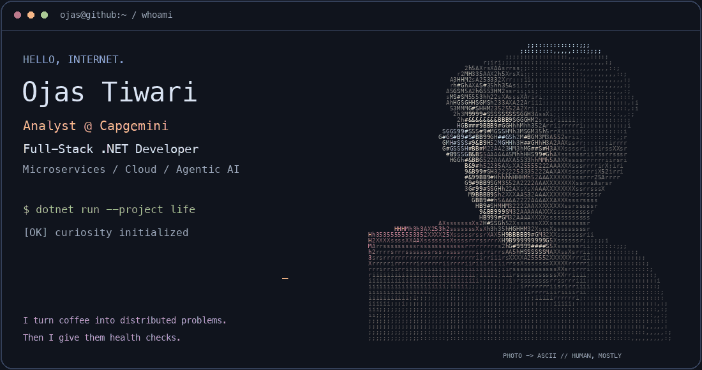
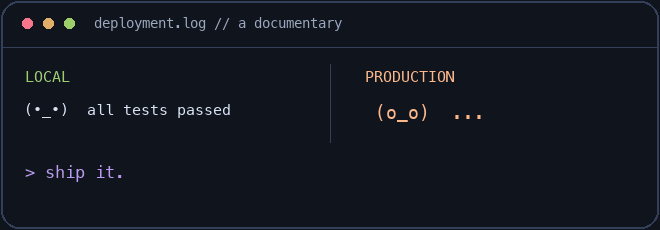
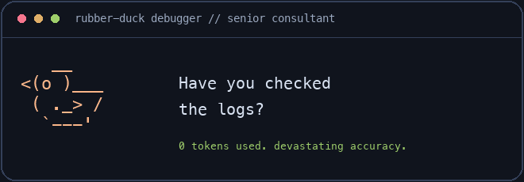

<div align="center">

# Ojas Tiwari

**Full-Stack .NET Developer · Microservices · Agentic AI**



[About](#whoami) · [Experience](#experience) · [Projects](#featured-projects) · [Stack](#tech-arsenal) · [Education](#education--certifications) · [Stats](#github-analytics) · [Contact](#get-in-touch)

<sub>The portrait is made of actual characters. The character development is still in progress.</sub><br/>
<sub><a href="./assets/ojas-terminal-static.png">Still version</a> · <a href="./assets/ojas-portrait.txt">Inspect the ASCII</a></sub>

<a href="https://github.com/ojas2005">
  
</a>

<br/>

[](https://linkedin.com/in/ojas-tiwari-122402253)
[](https://portfolio-website-main-lac.vercel.app)
[](mailto:tiwariojas578@gmail.com)
[](https://github.com/ojas2005)


</div>

> **Choose your side quest:** hiring? Start with [experience](#experience). Building something? Open [projects](#featured-projects). Debugging? The duck below has concerningly good advice.


---

<!-- ═══════════════════════════ ABOUT ═══════════════════════════ -->
## whoami

*Software engineer. Part-time distributed-systems therapist. Full-time “one last commit” enthusiast.*


```csharp
public class Ojas : IDeveloper
{
    public string Role      => "Analyst @ Capgemini";
    public string Location  => "Navi Mumbai, India";
    public string[] Stack   => ["C#", ".NET 8", "Azure", "React", "Angular"];
    public string Learning  => "LangGraph • Agentic AI • System Design";
    public string Motto     => "Ship it clean, scale it later — but design for later.";
}
```

**Full-Stack .NET Developer** building production-grade **microservices** and **AI-powered** applications.
B.Tech CS from **GLA University** (2026), now shipping industrial full-stack projects at **Capgemini**.

- 🔭 Currently building an **Intelligent Recruitment Assistant** (.NET Web API + Azure AI resume pipeline)
- 🌱 Deep-diving into **Agentic AI** — LangGraph, multi-agent orchestration, RAG
- ⚡ Obsessed with **clean architecture**, message-driven systems and sub-100ms APIs
- 💬 Ask me about **ASP.NET Core, EF Core, microservices, RabbitMQ, Azure**

<br clear="right"/>

---


<details>
<summary><strong>🦆 Open the incident report: two original GIFs, zero useful stack traces</strong></summary>

<table>
<tr>
<td width="50%" align="center"><a href="./assets/works-on-my-machine.gif"></a><br/><strong>Environment parity is a love language.</strong></td>
<td width="50%" align="center"><a href="./assets/duck-debugger.gif"></a><br/><strong>Senior consultant. Paid in breadcrumbs.</strong></td>
</tr>
</table>

These local GIFs play twice, then stop. Your CPU did not sign up for a second job.

</details>

<!-- ═══════════════════════════ EXPERIENCE ═══════════════════════════ -->
## Experience

*The part where “it works on my machine” has to become “it works on the client’s machine.”*

<details open>
<summary><b>🏢 Analyst — Capgemini &nbsp;·&nbsp; <i>Jul 2026 – Present</i></b></summary>

<br/>

> Full-stack development on industrial client projects.

`C#` `.NET 8` `ASP.NET Core` `Azure` `SQL Server` `React` `Angular`

- Building and maintaining full-stack features on enterprise industrial systems
- Working across API, data and UI layers end-to-end
- Continuously onboarding new technologies as project needs evolve

</details>

<details>
<summary><b>🎓 .NET Developer Trainee — Capgemini &nbsp;·&nbsp; <i>Dec 2025 – Jun 2026</i></b></summary>

<br/>

`C#` `.NET 8` `EF Core 8` `PostgreSQL` `Docker` `RabbitMQ` `Redis` `Angular`

- Completed an intensive 5-month training + certification track (A4 .NET Developer)
- Shipped **3 production-grade projects** deployed to Azure
- Designed an **8-service microservices LMS** behind a YARP gateway
- Cut development time **~30%** using AI tooling (Copilot, Claude)
- Implemented enterprise auth: **JWT + Google OAuth 2.0 + PBKDF2**

</details>

---

<!-- ═══════════════════════════ PROJECTS ═══════════════════════════ -->
## Featured projects

*Things I built instead of maintaining a reasonable number of browser tabs.*

<div align="center">
<i>Click a project to open its case file. No NDA. No 47-slide deck. ⤵</i>
</div>

<br/>

<details open>
<summary><b>🎓 Learnify (EduLearn) — Microservices LMS &nbsp;</b></summary>

<br/>


> Eight services. Because apparently one place for a bug to hide was not enough.

**8 independent services** — Identity · Registration · Courses · Curriculum · Exams · Reviews · Tracking · Analytics

```
Backend:   .NET 8 · ASP.NET Core · EF Core 8
Database:  MySQL (Pomelo provider) — schema per service
Gateway:   YARP reverse proxy, single public entry point
Frontend:  React dashboards + Angular admin panel
Auth:      ASP.NET Identity · JWT bearer · Google OAuth 2.0
Tests:     NUnit + Moq · Dockerfile per service
```

- Schema-per-service ownership — no service reads another's tables
- Gateway is the only public surface, so topology can change without breaking clients
- `Learnify.Core` holds contracts only; business rules stay in the service that owns them

[](https://github.com/ojas2005/Learnify)
[](https://github.com/ojas2005/LearnifyFrontend)
[](https://learnify-frontend-ten-sable.vercel.app)

<br clear="right"/>

</details>

<details>
<summary><b>🤖 Intelligent Recruitment Assistant — AI Resume Pipeline &nbsp;</b></summary>

<br/>

> Five agents, one hiring pipeline. Finally, a group project where everyone has an assigned job.

Multi-agent hiring platform that screens, scores and ranks candidates — and explains every recommendation.

```
Backend:   .NET 9 · ASP.NET Core (Web API + MVC) · Clean Architecture
Agents:    Semantic Kernel — Parser · Matching · Interview · Ranking · Reviewer
AI:        Azure OpenAI (GPT-4o + embeddings) · Document Intelligence
Grounding: RAG via Azure AI Search against approved hiring criteria
Data:      Azure Cosmos DB · Blob Storage · Key Vault · Entra ID
Tests:     xUnit — 37 tests, deterministic offline fallbacks
```

- Five specialised agents instead of one giant prompt, each with a single job
- RAG grounds every evaluation in approved criteria, not model guesswork
- A reviewer agent checks fairness and consistency before results reach the recruiter
- Full audit trail on every AI decision; core logic is Azure-independent and runs offline

</details>

<details>
<summary><b>📐 QuantityMeasurementApp — N-Tier Unit Conversion API</b></summary>

<br/>

```
Backend:  .NET 8 · ASP.NET Core · EF Core · PostgreSQL
Frontend: React.js
Caching:  IMemoryCache
```

- Clean **N-Tier** split: Presentation → Business → Data Access → Database
- Generic domain model handling **14+ unit types** without per-unit branching- Generic repository pattern · global exception middleware · Swagger UI

> Converts units. Still cannot convert “almost done” into an accurate ETA.

[](https://github.com/ojas2005/QuantityManagementApp)
[](https://github.com/ojas2005/QuantityManagementApp_Frontend)
[](https://quantitymanagementapp-frontend.onrender.com)

</details>

<details>
<summary><b>🎮 Esports Collaboration Portal — MERN Platform</b></summary>

<br/>

`React.js` `Node.js` `Express.js` `MongoDB`

> Teamwork, matchmaking and a REST API. The backend has fewer rage-quits.

Connects esports **players, organizers and sponsors** in one place — player profiles, event discovery, sponsorship forms, RESTful API and a mobile-first responsive UI.

</details>

<details>
<summary><b>🚦 Smart Traffic Management System &nbsp;</b></summary>

<br/>

`Raspberry Pi` `Python` `OpenCV` `IR Sensors` `Machine Learning`

Real-time traffic violation detection with an automated **digital challan** system.

> The only project here that can turn a bad decision into a challan.
🏆 **Winner — Government Science Exhibition, Mathura (2023)**

</details>

---

<!-- ═══════════════════════════ TECH STACK ═══════════════════════════ -->
## Tech arsenal

*Tools I use to solve problems. Occasionally, tools I use to solve problems caused by the other tools.*

<div align="center">

**Languages & Backend**


**Frontend & Databases**


**Cloud & DevOps**


</div>

<br/>

<details>
<summary><b>🧩 Architecture, Patterns & AI Tooling</b></summary>

<br/>

| Area | What I work with |
|---|---|
| **Architecture** | Microservices · N-Tier · Event-Driven · Clean Architecture |
| **API** | REST design · API Gateways (YARP) · Swagger/OpenAPI · Versioning |
| **Messaging** | RabbitMQ · MassTransit · Pub/Sub choreography |
| **Security** | JWT · OAuth 2.0 · PBKDF2 · Role-based authorization |
| **Data** | SQL Server · PostgreSQL · MongoDB · Redis · Query optimization |
| **AI / GenAI** | LangChain · LangGraph · Azure AI Foundry · RAG · Embeddings |
| **Dev Tools** | GitHub Copilot · Claude · Docker · Postman · Git |

</details>

---

<!-- ═══════════════════════════ EDUCATION ═══════════════════════════ -->

## Education & certifications

*Yes, I collect certifications. No, they do not make CSS center itself.*


**🎓 B.Tech, Computer Science** — GLA University, Mathura *(Graduated May 2026)*
*Focus: Full-Stack Development · Cloud Computing · AI/ML*

<details open>
<summary><b>📜 Certifications</b></summary>

<br/>

| Certification | Organization | Date |
|---|---|---|
| Claude Certified Architect - Foundations | Anthropic | Sep 2026 |
| Claude Certified Associate - Foundations | Anthropic | Sep 2026 |
| Claude Certified Developer - Foundations | Anthropic | Sep 2026 |
| Azure Fundamentals | Microsoft | Jul 2026 |
| ML for IIoT · IIoT Communication · Smart Industrial Connectivity · Data Science · Intro to IoT | GLA University | Feb 2025 |

</details>

<details>
<summary><b>🏆 Achievements & Beyond Code</b></summary>

<br/>

- 🥇 **Government Science Exhibition Winner** — Mathura, 2023, for the Smart Traffic Management System
- 🎮 **Esports Player and Event Organizer** — Won many Esports events and co-organized tournaments in partnership with **Jio Games**

</details>

---

<!-- ═══════════════════════════ STATS ═══════════════════════════ -->
## GitHub analytics

*The grass is greener where you `git push`. Graphs are activity, not a personality test.*

<div align="center">


<details>
<summary><b>📊 More stats</b></summary>

<br/>


</details>

<br/>

<!-- 🐍 Contribution snake — needs the workflow in .github/workflows/snake.yml -->
<picture>
  <source media="(prefers-color-scheme: dark)" srcset="https://raw.githubusercontent.com/ojas2005/ojas2005/output/github-contribution-grid-snake-dark.svg" />
  <source media="(prefers-color-scheme: light)" srcset="https://raw.githubusercontent.com/ojas2005/ojas2005/output/github-contribution-grid-snake.svg" />
  
</picture>

</div>

---

<!-- ═══════════════════════════ CONTACT ═══════════════════════════ -->
## Get in touch

*My inbox supports collaboration, opportunities and architecture debates. “Just one tiny feature” is rate-limited.*


**Always open to:**

- 💼 Full-stack .NET & cloud opportunities
- 🤝 Collaboration on microservices or Agentic AI projects
- 🧠 Mentoring, knowledge sharing and good architecture arguments

[](mailto:tiwariojas578@gmail.com)
[](https://linkedin.com/in/ojas-tiwari-122402253)

<br clear="right"/>

<div align="center">


**If you find my work interesting, drop a ⭐ on a repo — it genuinely helps.**

Stars are free. Debugging at 2 a.m. is paid for in character development.


</div>


